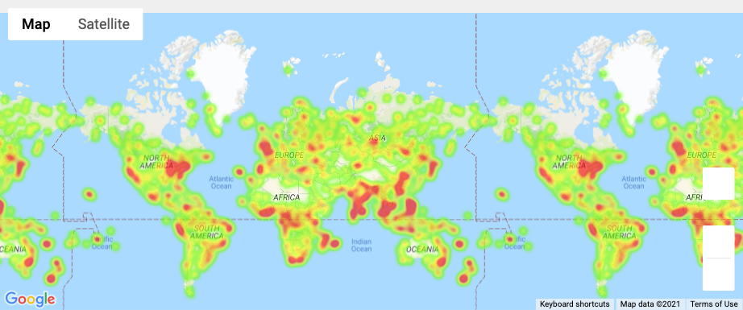

# python-api-challenge
Repo for Chapter 6 Homework
 
# WeatherPy
## Most of my time was spent aquiring the data, as I attempted to modify citipy's nearest_city function so that it used OpenWeatherMap's list of cities, a .json file containing over 4 million cities...
## Although my function worked, I couldn't quite capture enough speed with which to feasibly call over 1000 cities.
## So I went back to using citipy's function, and my concern that many of the requests would garner a 404 response proved untrue. Out of 1500 requests made, I received 1382m responses with status 200.

### Here are all the plots I've made for ~1400 random cities:

vsLatitude.png)
vsNorthernLatitudeRegression.png)
vsSouthernLatitudeRegression.png)

### There really isn't much relationship between latitude and cloudiness, humidity, or wind speed, at least at the time and date this data was collected (10/7/2021 around midday). However, there is a strong linear relationship between maximum temperature and distance from the equator; as the distance increases, you can expect maximum temperature to decrease! It's relieving that our data analysis matches up agrees with basic earth science.

# VacationPy
## To begin, here is my humidity heatmap for my random cities:

## Moving on, I chose to narrow down my city list in a couple of ways:
### Max Temperature between 65 and 80 degrees
### Humidity less than 50%
### Not in the US 
### Cloudiness less than 50%
### and Wind Speed less than 5 mph
## This left me with a sensible 14 cities.