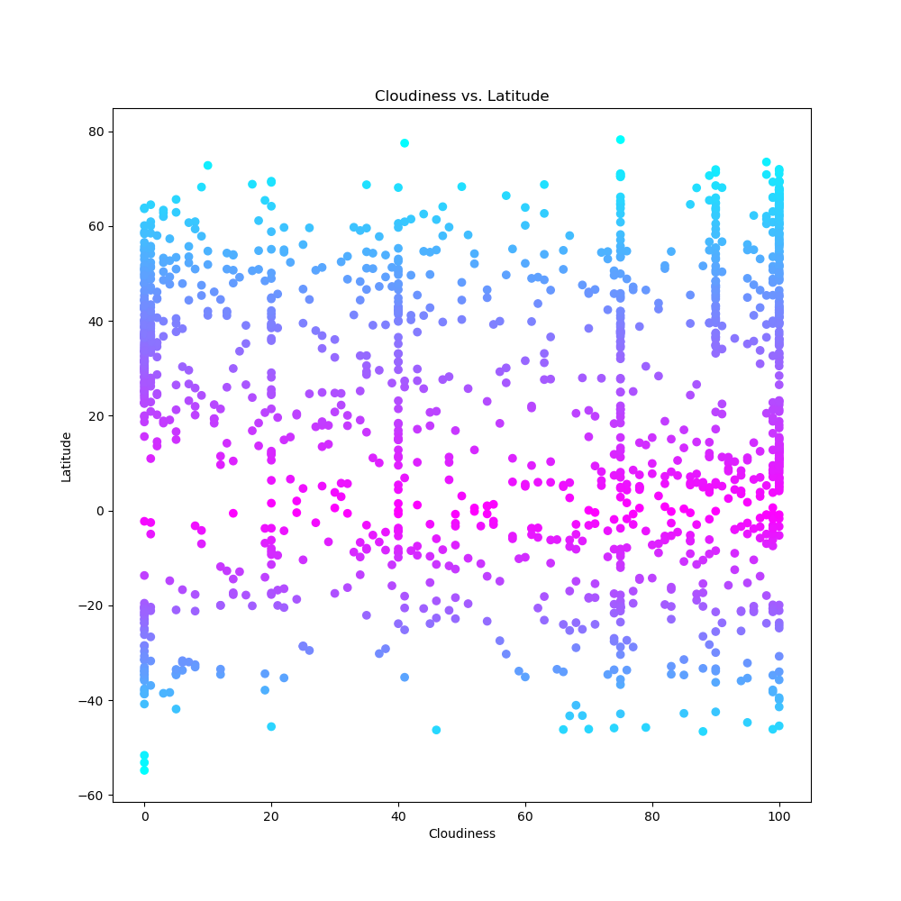
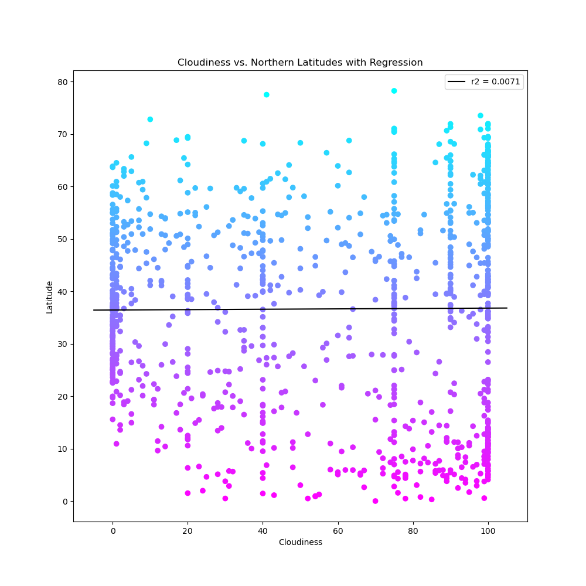
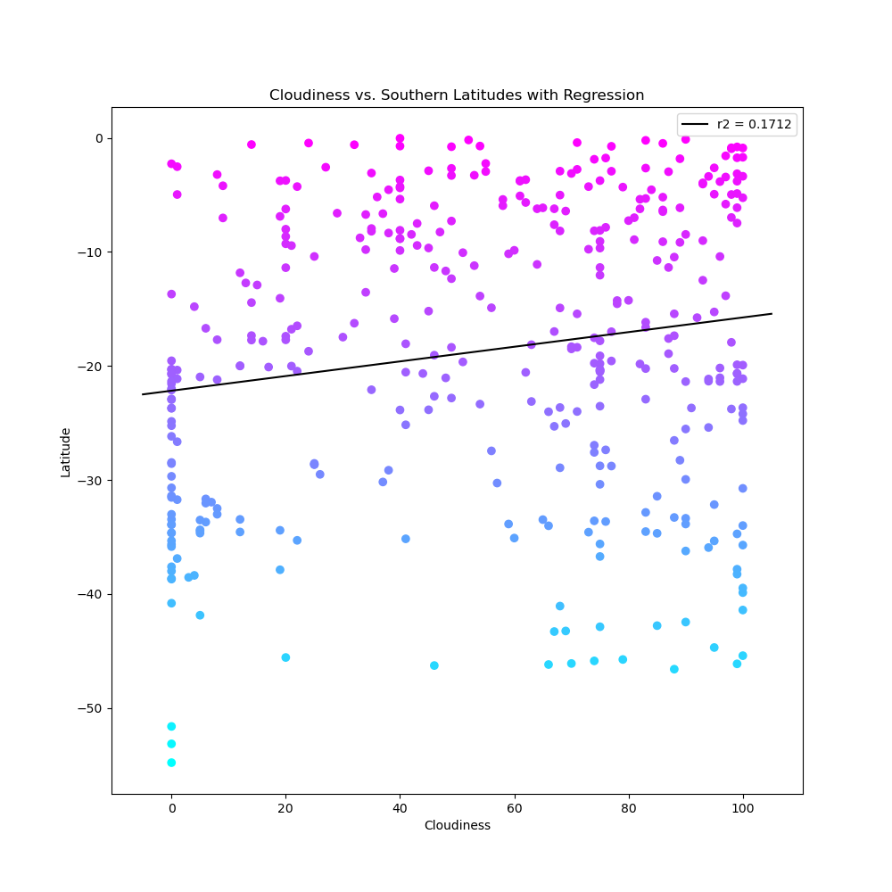
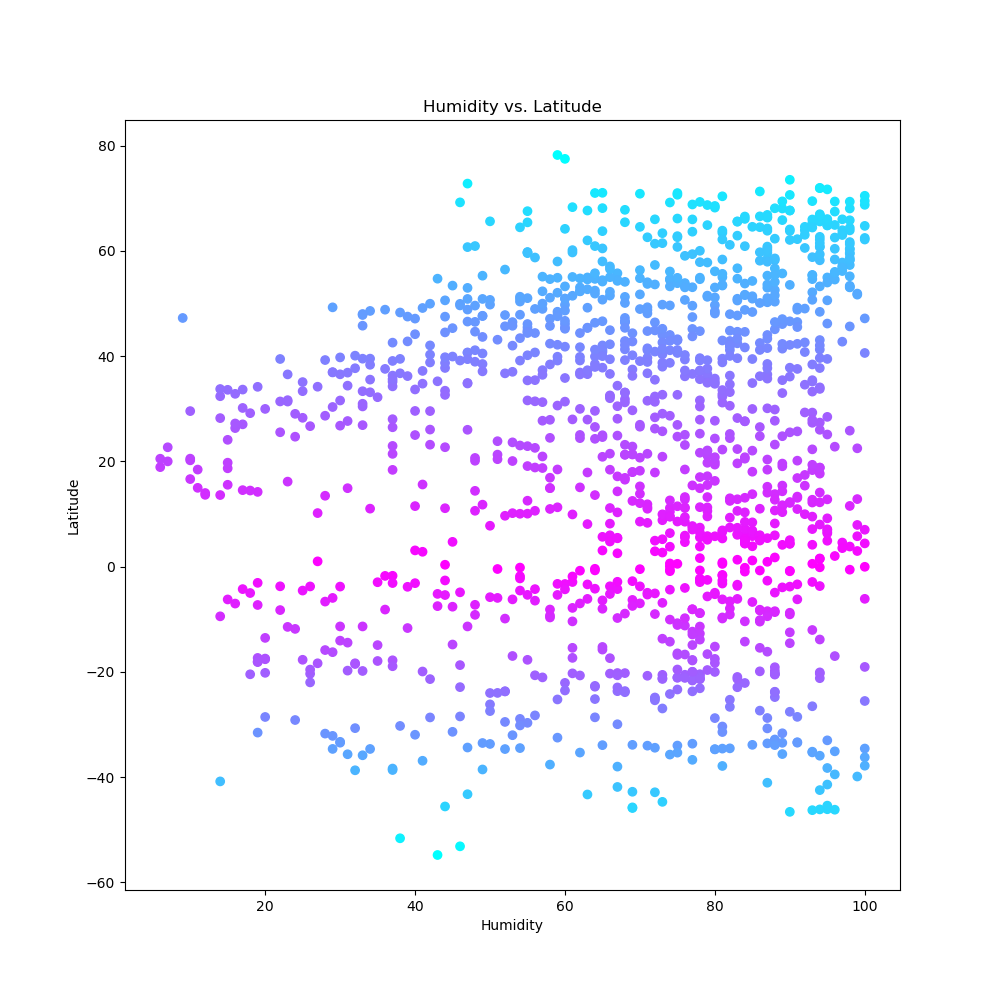
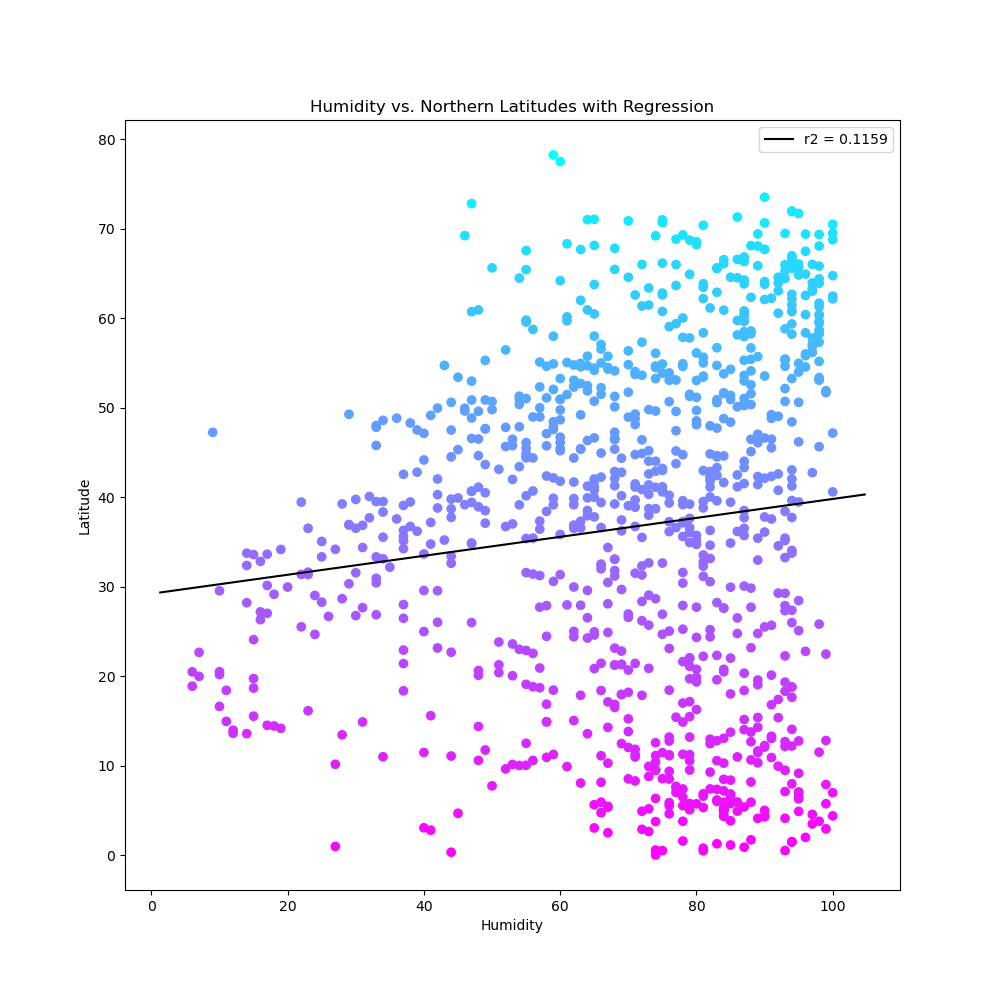
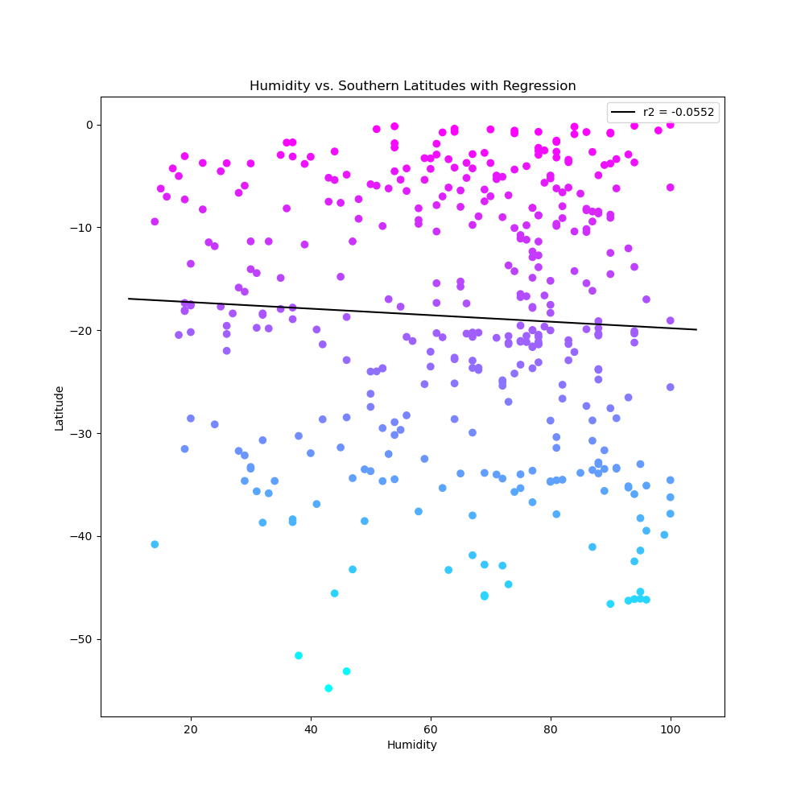

# python-api-challenge
Repo for Chapter 6 Homework
Here are all the plots I've made for ~1400 random cities:

vsLatitude.png)
vsNorthernLatitudeRegression.png)
vsSouthernLatitudeRegression.png)

